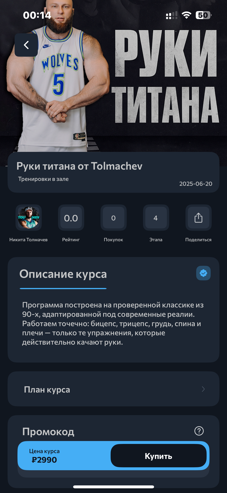
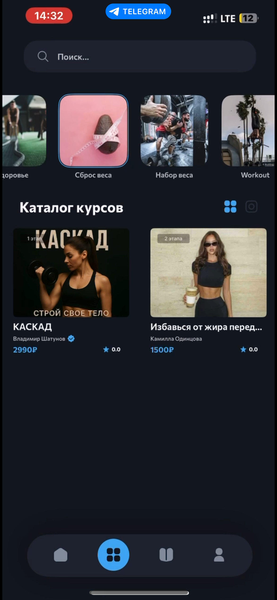
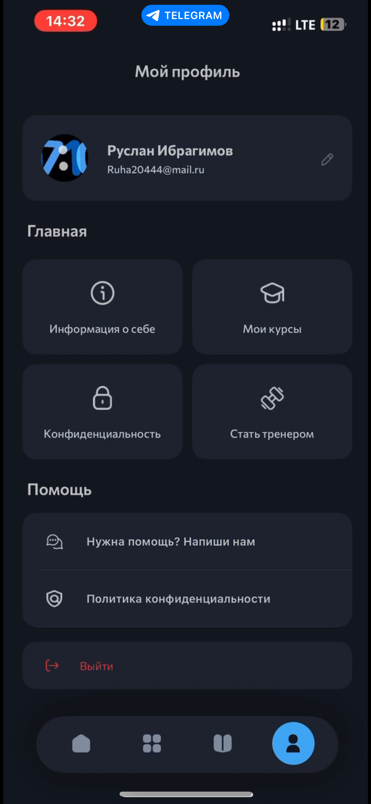
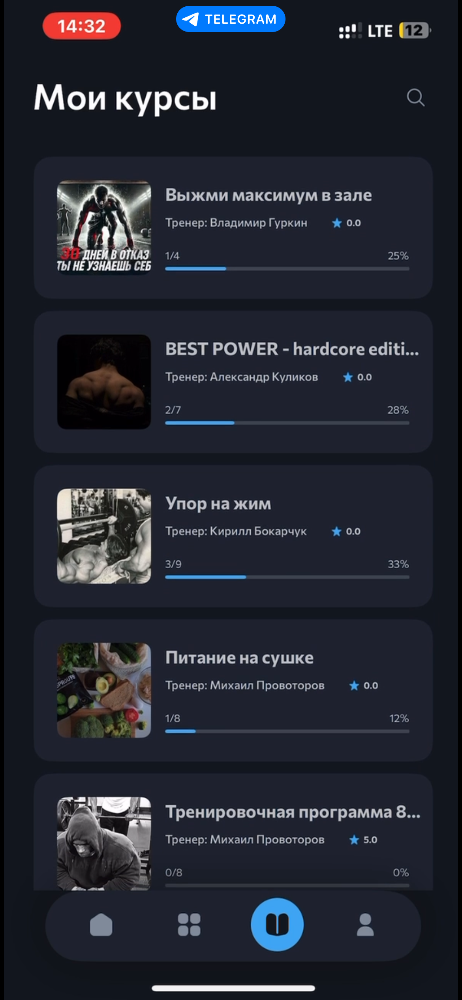
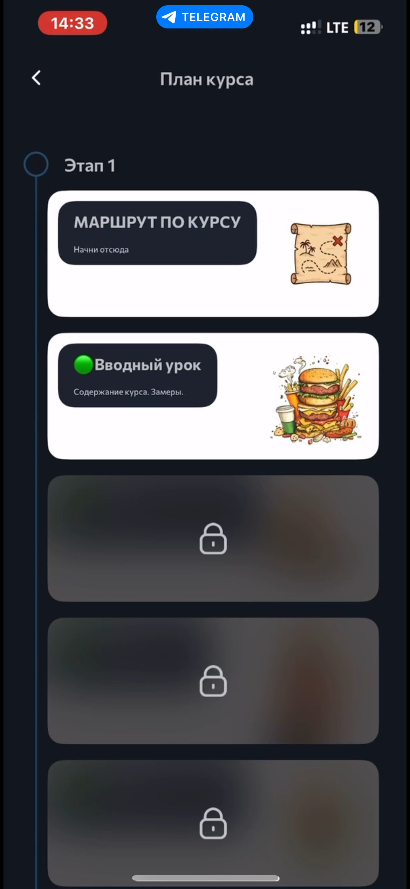

# StrideMVP
fitness App

# 🏃‍♂️ Stride — фитнес-платформа нового поколения

> Платформа, где тренеры создают и продают свои курсы.  
> Пользователи получают доступ к лучшим онлайн-тренировкам и персональным программам прямо на своих устройствах (iOS / Android).

---

## 🚀 О проекте

**Stride** — это мобильное приложение и экосистема для монетизации фитнес-экспертизы.  
Тренеры могут создавать видеокурсы, продавать их аудитории и получать стабильный доход.  
Пользователи — находить программы под свои цели и заниматься где угодно.

### 📱 Основные возможности

- 🧑‍🏫 Создание и продажа фитнес-курсов  
- 💳 Встроенные покупки и аналитика продаж  
- 🎥 Видеоуроки, тренировки, челленджи  
- 🔔 Push-уведомления и система напоминаний  
- ⭐ Профили тренеров и отзывы пользователей  
- 📊 Статистика по выручке и прогрессу

---

## 🧩 Технологии

| Область         | Стек                    |
| --------------- | ----------------------- |
| iOS             | Swift, UIKit            |
| Android         | Kotlin, Jetpack Compose |
| Backend         | Python                  |
| Design          | Figma                   |
| Version Control | Git, GitHub             |
| Analytics       | AppMetrica              |

---

## 💡 Команда

- **Ibragimov R.** — iOS Lead Developer  
- **Stride Team** — Full Stack разработка (Android, Backend, QA, Design)

---

## 🧠 Архитектура

- **MVP** для клиентских приложений  
- Поддержка **CI/CD** через GitHub Actions

---

## 📸 Скриншоты

|                                                      |                                                      |                                                      |
| ---------------------------------------------------- | ---------------------------------------------------- | ---------------------------------------------------- |
|  |  |  |
|  |  |  |

---

## 🤝 Контакты

💬 По вопросам сотрудничества: **ibragimovr04@mail.ru**  
🔗 GitHub: [@IbragimovRr](https://github.com/IbragimovRr)
📱 AppStore: https://apps.apple.com/ru/app/stride/id6737005692

---

### ⭐ Если тебе нравится проект — поддержи его звёздой на GitHub!
